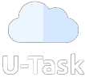
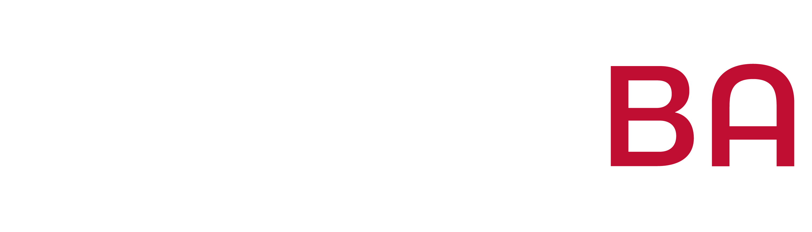
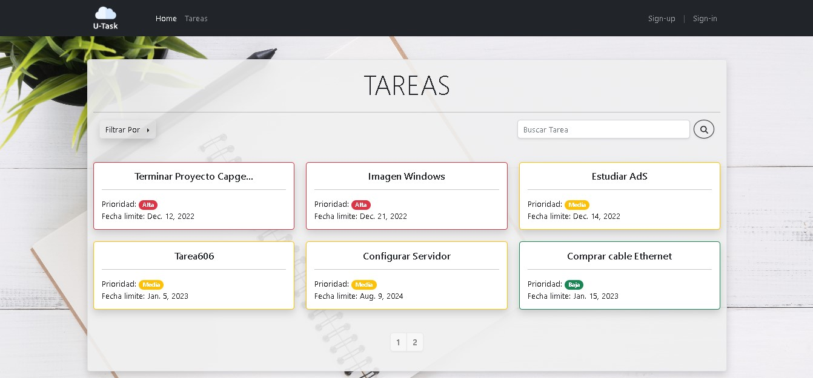

<div align="center">

  
  <h1></h1>
  
  <p>
    <i>Este Proyecto fue realizado para la Academia Python 2022</i> - <a href="https://www.capgemini.com/ar-es/">Capgemini</a> | <a href="https://www.frba.utn.edu.ar/">UTN FRBA</a>
  </p>
  
  <div align="center" style="display:flex;justify-content:center; align-items:center;">&nbsp;&nbsp;&nbsp;&nbsp;</div>
 <br/>
  


  
</div>

<br />

<!-- Sobre el proyecto -->
## :pushpin: Sobre el Proyecto

<!-- Descripción -->
### :mag_right: Descripción

U-Task es una aplicación diseñada para la gestión y organización de tareas. Fue desarrollada para fines educativos durante la 'Academia Python 2022' brindada a partir del convenio entre [Capgemini](https://www.capgemini.com/ar-es/) y [UTN FRBA](https://www.frba.utn.edu.ar/).

A modo de resúmen, U-Task permite crear tareas, ordenarlas, modificarlas, exportarlas, entre otras funcionalidades que facilitarán la manera en la que los usuarios gestionan sus actividades diarias y proyectos.

<!-- Guía de instalación -->
### :computer: Guía de instalación

El proyecto fue desarrollado sobre Python 3.9 o versiones superiores.

Además, se utilizó:
  + Framework [Django 4.1](https://www.djangoproject.com/)
  + El sistema de gestión de Bases de Datos [MySQL](https://www.mysql.com/)
  + Y las librerias:
    + [OpenCV v4.6.0.66](https://docs.opencv.org/4.x/index.html)
    + [Tesseract OCR v5.3.0](https://github.com/tesseract-ocr/tessdoc)
    + [pymysql v1.0.2](https://pypi.org/project/PyMySQL/)
    + [mysqlclient v2.1.1](https://pypi.org/project/mysqlclient/)

#### :clipboard: Instalar dependencias

```
pip install django==4.1
pip install opencv-python==4.6.0.66
pip install pytesseract
pip install pymysql==1.0.2
pip install mysqlclient==2.1.1
```
[Link de instalación](https://github.com/UB-Mannheim/tesseract/wiki) Tesseract OCR v5.3.0

#### :cd: Lanzar proyecto en servidor local

```
python manage.py makemigrations
python manage.py migrate
python manage.py test
python manage.py runserver
```

Luego de iniciar el servidor local de Django, abra su navegador y diríjase a la url http://127.0.0.1:8000/ para acceder a la aplicación.

<!-- Capturas -->
### :camera: Capturas

<div align="center"> 
  
</div>

<!-- Autores -->
## :wave: Autores

* [Nahuel Orlando](https://github.com/naorlando): naorlando@frba.utn.edu.ar
* [Franco Cristofaro](https://github.com/frcristofaro): [linkedin.com/in/francocristofaro](https://www.linkedin.com/in/francocristofaro?lipi=urn%3Ali%3Apage%3Ad_flagship3_profile_view_base_contact_details%3BVi%2FFWcfPT%2FCCrIs%2FEPgTNg%3D%3D) - fcristofaro@frba.utn.edu.ar
* Fabrizio Hermosa: rhermosaramirez@frba.utn.edu.ar

Link del Proyecto: [https://github.com/naorlando/proyecto-python-grupo7](https://github.com/naorlando/proyecto-python-grupo7)

